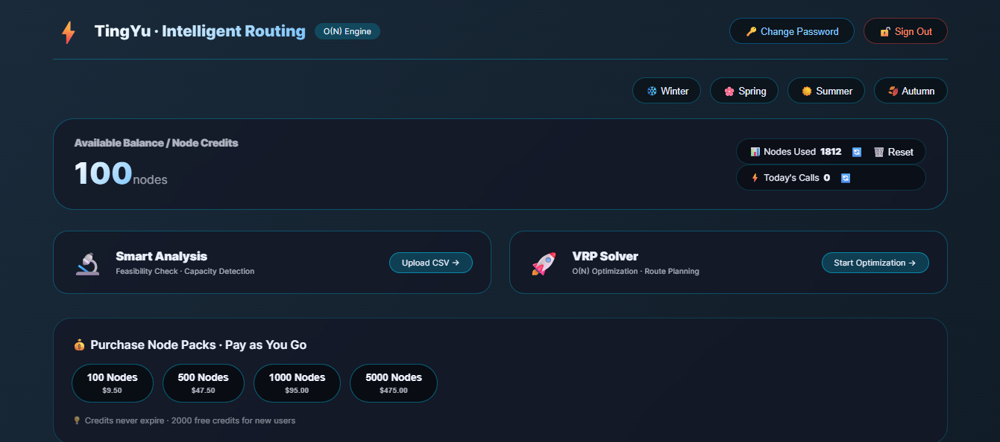
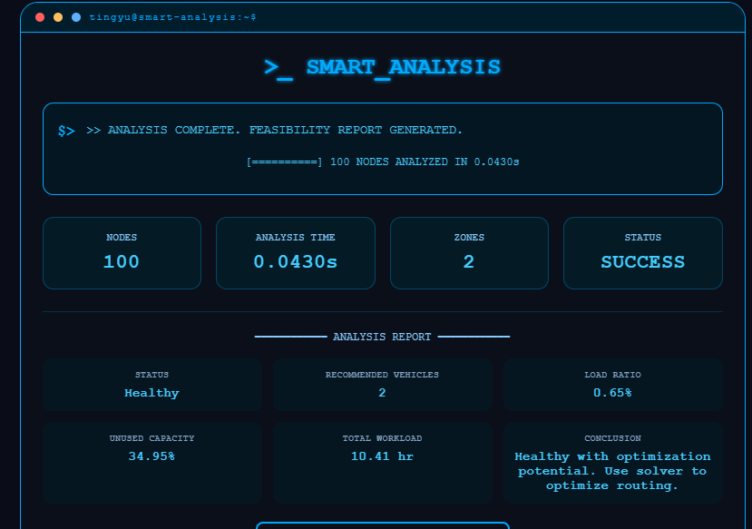
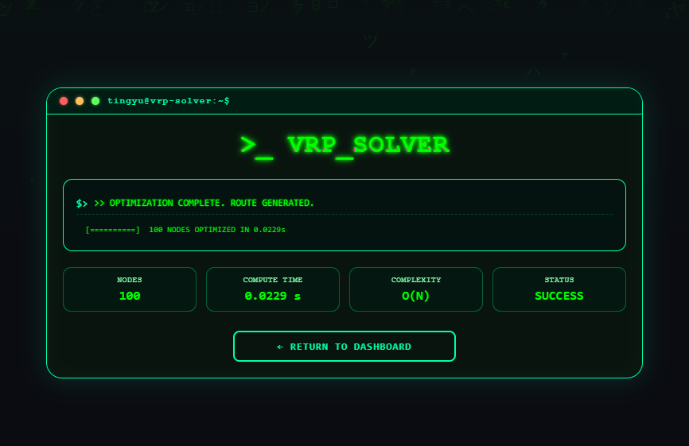

# 🚀 TingYu VRP Solver

---

⚡ **Instant VRP that actually works in real operations**  
No retries. No guessing. Just executable routes.

👉 **Live Demo:** https://tingyugeo.com  
🎁 **2000 free credits**

---

# 🎯 What is TingYu?

TingYu is a next-generation **Vehicle Routing Problem (VRP) solver** built for real logistics operations.

---

# ⚡ Key Features

### 🧠 Feasibility First
- Check if routes are actually executable  
- Avoid impossible dispatch plans  

---

### 🚚 Automatic Vehicle Detection
- No manual tuning  
- System decides optimal fleet size  

---

### ⚡ O(N) Real-Time
- 100 nodes → ~0.018s  
- No exponential slowdown  

---

### 🎯 Deterministic
- Same input → same output  
- No randomness  

---

# 🔄 Two-Stage System

### Stage 1 — Analysis
- Feasibility check  
- Zone partition  
- Resource allocation  

### Stage 2 — Solver
- Route optimization  
- 10–30% distance reduction  

---

# 📊 Example

- 100 nodes → 0.018s  
- 90%+ load balance  
- Fully executable routes  

---

# 💰 Why It Matters

- More deliveries  
- Less fuel cost  
- Better efficiency  

👉 **System pays for itself**

---

# 🧪 Try it

👉 https://tingyugeo.com  

Upload CSV → Get result instantly

---

# 🧠 Philosophy

From "Can Calculate" → **"Can Execute"**

---

# ⭐ If useful

Give a star ⭐
